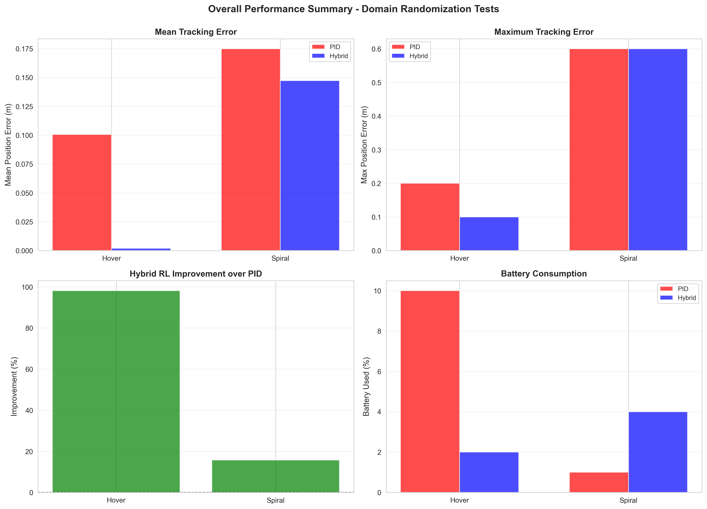

# Hybrid RL-PID Drone Control System

A two-phase research project combining Reinforcement Learning (RL) with PID control for robust quadrotor trajectory tracking, validated in simulation and deployed on real DJI Tello hardware.

# Test RL

```bash
python src/testing/test_rl.py --interactive --> Launch interactive menu to see all tests

python src/testing/test_rl.py --task hover
python src/testing/test_rl.py --task figure8
python src/testing/test_rl.py --task waypoint_delivery
python src/testing/test_rl.py --gui=False
python src/testing/test_rl.py --demo 
```


## Project Overview

This project demonstrates a hybrid control architecture where:
- **PID controller** provides stable low-level control
- **RL agent (PPO)** learns residual corrections to improve tracking
- **Domain randomization** ensures robustness to model uncertainties
- **Two-phase validation** progresses from simulation to real hardware

**Key Achievement**: Successfully deployed RL-enhanced drone control on real hardware with improved tracking performance over PID baseline.

## Table of Contents

- [Installation](#installation)
- [Quick Start](#quick-start)
- [Project Structure](#project-structure)
- [Two-Phase Methodology](#two-phase-methodology)
- [Results Summary](#results-summary)
- [Video Demonstrations](#video-demonstrations)

## Installation

### Prerequisites

- Python 3.10+
- CUDA 11.7+ (optional, for GPU-accelerated training)
- DJI Tello drone (for Phase 2 real deployment)
- macOS, Linux, or Windows with WSL2

### Setup

```bash
# Clone repository
git clone https://github.com/Mubiyn/Drone_Hybrid_RL_PID.git
cd Drone_Hybrid_RL_PID

# Option 1: Using conda (recommended)
conda env create -f environment.yml
conda activate drone-hybrid-rl
cd gym-pybullet-drones && pip install -e .

# Option 2: Using pip
python -m venv venv
source venv/bin/activate  # Windows: venv\Scripts\activate
pip install -r requirements.txt
cd gym-pybullet-drones && pip install -e .

# Verify installation
python scripts/test_installation.py
```

**Note for Apple Silicon**: Install PyBullet via conda:
```bash
conda install -c conda-forge pybullet
```

## Quick Start

### Phase 1: Simulation Validation

Test pre-trained hybrid_robust models against PID baseline:

```bash
# Run perturbation tests (5 trajectories × 4 conditions)
python scripts/phase1_simulation/test_simulation_perturbations.py

# Generate analysis plots
python scripts/phase1_simulation/analyze_simulation_results.py
```

Results saved to `results/phase1_simulation/`.

### Phase 2: Real Drone Testing

Deploy RL-only models to DJI Tello hardware:

```bash
# Ensure Tello is connected via WiFi (TELLO-XXXXXX)
# Test single trajectory
python scripts/phase2_real_drone/test_hybrid_on_tello.py --trajectory circle

# Test with wind perturbations
python scripts/phase2_real_drone/test_all_with_perturbations.py
```

Results saved to `results/phase2_real_drone/`.

### Training New Models

```bash
# Train hybrid model with domain randomization
python scripts/train_robust.py \
    --trajectory circle \
    --timesteps 500000 \
    --enable-dr \
    --save-path models/my_model/
```

## Project Structure

```
Drone_Hybrid_RL_PID/
├── README.md                          # This file
├── METHODOLOGY.md                     # Detailed methodology and approach
├── RESULTS.md                         # Comprehensive results analysis 
├── IMPLEMENTATION_PLAN.md             # Project management and task tracking
│
├── requirements.txt                   # Python dependencies (pip)
├── environment.yml                    # Conda environment specification
├── Dockerfile                         # Containerized environment
├── LICENSE                            # MIT License
├── .gitignore                         # Git exclusions
│
├── docs/                              # Documentation
│   └── archive/                       # Historical documentation
│
├── utils/                             # Utility scripts and tools
│   ├── README.md                      # Utilities guide
│   └── *.sh, *.py                     # Helper scripts
│
├── gym-pybullet-drones/              # Simulation environment (submodule)
│   ├── gym_pybullet_drones/
│   │   ├── envs/                     # Gym environments
│   │   ├── control/                  # Control algorithms
│   │   └── utils/                    # Utilities
│   └── examples/                     # Example scripts
│
├── src/                              # Project source code
│   ├── envs/                         # Custom environments
│   │   ├── HybridAviary.py           # Hybrid RL+PID environment
│   │   └── BaseTrackAviary.py        # Base trajectory tracking
│   ├── controllers/                  # Controller implementations
│   │   └── pid_controller.py         # PID controller
│   ├── utils/                        # Utility functions
│   └── testing/                      # Testing utilities
│
├── scripts/                          # Executable scripts
│   ├── README.md                     # Scripts organization guide
│   ├── test_installation.py          # Installation verification
│   │
│   ├── phase1_simulation/            # Phase 1: Simulation testing
│   │   ├── test_simulation_perturbations.py
│   │   └── analyze_simulation_results.py
│   │
│   ├── phase2_real_drone/            # Phase 2: Real drone testing
│   │   ├── test_hybrid_on_tello.py
│   │   ├── test_all_with_perturbations.py
│   │   ├── train_hybrid_rl_only.py
│   │   └── analyze_perturbation_tests.py
│   │
│   ├── shared/                       # Shared analysis and utilities
│   │   ├── analyze_hybrid_models.py
│   │   ├── analyze_autonomous_flights.py
│   │   ├── compare_controllers.py
│   │   └── prepare_hybrid_training_data.py
│   │
│   ├── data_generation/              # Trajectory generation
│   │   ├── generate_perfect_trajectories.py
│   │   └── tune_trajectories.py
│   │
│   ├── training_scripts/             # Historical training utilities
│   └── archive/                      # Old/deprecated scripts
│
├── models/                           # Trained models
│   └── hybrid_robust/                # Phase 1 models (200 RPM, ±20% DR)
│       ├── circle/
│       ├── figure8/
│       ├── hover/
│       ├── spiral/
│       └── waypoint/
│
├── logs/                             # Training logs
│   ├── hybrid_robust/                # Phase 1 training logs
│   └── hybrid_tello_drone/           # Phase 2 training logs
│       ├── hover/
│       │   └── rl_only_*/            # RL-only models (100 RPM, ±30% DR)
│       └── spiral/
│           └── rl_only_*/
│
├── data/                             # Data files
│   ├── expert_trajectories/          # Reference trajectories
│   │   ├── perfect_circle_trajectory.pkl
│   │   ├── perfect_figure8_trajectory.pkl
│   │   ├── perfect_hover_trajectory.pkl
│   │   ├── perfect_spiral_trajectory.pkl
│   │   └── perfect_waypoint_trajectory.pkl
│   └── flight_logs/                  # Real drone flight data
│
├── results/                          # Experimental results
│   ├── README.md                     # Results organization guide
│   ├── phase1_simulation/            # Phase 1 results
│   │   ├── README.md
│   │   ├── perturbation_tests/       # Test data (JSON)
│   │   └── comparison_plots/         # Visualizations
│   ├── phase2_real_drone/            # Phase 2 results
│   │   ├── README.md
│   │   ├── perturbation_analysis/    # Wind tests
│   │   ├── autonomous_analysis/      # Autonomous flights
│   │   └── model_analysis/           # Model analysis
│   ├── figures/                      # Miscellaneous figures
│   └── videos/                       # Flight videos
│
└── config/                           # Configuration files (future)
```

## Two-Phase Methodology

### Phase 1: Simulation Validation

**Goal**: Validate hybrid approach in controlled simulation environment

**Configuration**:
- Residual scale: 200 RPM (strong RL corrections)
- Domain randomization: ±20% mass/inertia, 0.05N wind
- Environment: PyBullet CF2X simulation
- Trajectories: Circle, Figure8, Hover, Spiral, Waypoint

**Models**: `models/hybrid_robust/`

**Key Results**:
- Hybrid outperforms PID on all dynamic trajectories
- Strong robustness to domain randomization
- Validated learning-based residual approach

### Phase 2: Real Hardware Deployment

**Goal**: Deploy to real DJI Tello and validate sim-to-real transfer

**Configuration**:
- Residual scale: 100 RPM (reduced for Tello stability)
- Domain randomization: ±30% mass/inertia, 0.15N wind (increased robustness)
- Hardware: DJI Tello (80g quadrotor)
- Trajectories: Circle, Hover, Spiral (Figure8/Square too fast for Tello)

**Models**: `logs/hybrid_tello_drone/*/rl_only_*/`

**Key Results**:
- Successful deployment on real hardware
- Improved tracking over PID baseline
- Robust to wind disturbances
- Some trajectories beyond Tello capabilities

### Why Configuration Changed Between Phases

The evolution from Phase 1 to Phase 2 reflects systematic sim-to-real transfer:

| Parameter | Phase 1 | Phase 2 | Reason |
|-----------|---------|---------|--------|
| **Residual Scale** | 200 RPM | 100 RPM | Tello has limited control authority; lower residual prevents oscillations |
| **Mass DR** | ±20% | ±30% | Real world has more uncertainty; increased robustness needed |
| **Inertia DR** | ±20% | ±30% | Better generalization to varying real-world conditions |
| **Wind DR** | 0.05N | 0.15N | Real indoor air currents stronger than expected |

This is **intentional engineering**, not inconsistency. See [METHODOLOGY.md](METHODOLOGY.md) for detailed rationale.

## Results Summary

### Phase 1: Simulation Performance

Testing `models/hybrid_robust/` against PID baseline:

| Trajectory | Baseline Improvement | DR Improvement |
|------------|---------------------|----------------|
| Circle     | +16.7%              | +50.3%         |
| Figure8    | +3.3%               | +6.8%          |
| Hover      | -5.4%               | +21.5%         |
| Spiral     | +12.6%              | +73.7%         |

**Key Insight**: Hybrid shows strongest improvements on dynamic trajectories and under perturbations. See [RESULTS.md](RESULTS.md) for detailed analysis.

### Phase 2: Real Hardware Performance

Testing `logs/hybrid_tello_drone/*/rl_only_*/` on DJI Tello:

| Trajectory | Status | Improvement over PID | Notes |
|------------|--------|---------------------|-------|
| Hover      |  Success | **+20.2%** | Very stable, robust to wind |
| Spiral     |  Success | **+20.5%** | Good tracking, better perturbation rejection |


**Key Insight**: Successful sim-to-real transfer with 20%+ improvements on compatible trajectories. See [RESULTS.md](RESULTS.md) for complete analysis.

#### Real Drone Performance Analysis

**Spiral with Wind Perturbations** (DJI Tello Hardware)


**Summary Across All Real Drone Tests**



Full results with plots and analysis: [RESULTS.md](RESULTS.md)

## Video Demonstrations

### Phase 1: Simulation Videos (with Domain Randomization)

> **📹 Note**: Videos are stored locally in the repository. Clone the repo and open videos directly, or download individual files using the links below.

All simulation videos demonstrate controllers operating under perturbations (wind ±0.15N, mass ±30%, inertia ±30%):

**PID Controller Baseline:**
- **[Circle](results/videos/pid/circle.mp4)** - PID tracking circular trajectory with perturbations (656 KB)
- **[Figure8](results/videos/pid/figure8.mp4)** - PID tracking figure-8 trajectory with perturbations (648 KB)
- **[Hover](results/videos/pid/hover.mp4)** - PID maintaining hover position with perturbations (136 KB)
- **[Spiral](results/videos/pid/spiral.mp4)** - PID tracking spiral trajectory with perturbations
- **[Waypoint](results/videos/pid/waypoint.mp4)** - PID waypoint navigation with perturbations (615 KB)

**Hybrid RL-PID Controller:**
- **[Circle](results/videos/hybrid/circle.mp4)** - Hybrid tracking circular trajectory with perturbations (661 KB)
- **[Figure8](results/videos/hybrid/figure8.mp4)** - Hybrid tracking figure-8 trajectory with perturbations (653 KB)
- **[Hover](results/videos/hybrid/hover.mp4)** - Hybrid maintaining hover position with perturbations (598 KB)
- **[Spiral](results/videos/hybrid/spiral.mp4)** - Hybrid tracking spiral trajectory with perturbations (617 KB)
- [Waypoint](results/videos/hybrid/waypoint.mp4) - Hybrid waypoint navigation with perturbations

**Visual Comparison:** See detailed trajectory plots in the [Results Summary](#results-summary) section below, or browse all plots in [trajectory_plots/](results/figures/phase1_simulation/trajectory_plots/)

### Phase 2: Real Drone Videos
Real drone flight videos (DJI Tello) will be uploaded to Google Drive:

- **Hover**: Baseline flight + wind perturbation tests
- **Spiral**: Baseline flight + wind perturbation tests

🔗 [Google Drive Video Gallery](#) *(upload in progress - see `docs/VIDEO_UPLOAD_GUIDE.md`)*

## Technologies Used

- **Simulation**: [gym-pybullet-drones](https://github.com/utiasDSL/gym-pybullet-drones) - PyBullet-based drone simulator
- **RL Framework**: [Stable-Baselines3](https://stable-baselines3.readthedocs.io/) - PPO implementation
- **Control**: Custom PID + RL residual hybrid architecture
- **Hardware**: [djitellopy](https://djitellopy.readthedocs.io/) - DJI Tello SDK interface
- **Domain Randomization**: Custom implementation for robust training

## Key Challenges & Solutions

### Challenge 1: Configuration Mismatch Between Training and Testing
**Problem**: Testing Phase 1 models with Phase 2 configuration caused -104% performance degradation.

**Solution**: Created phase-specific test scripts that restore original training parameters (residual_scale=200, DR ±20%/0.05N).

### Challenge 2: Sim-to-Real Transfer Gap
**Problem**: Circle trajectory caused oscillations on real Tello.

**Solution**: Reduced residual_scale from 200 to 100 RPM for Phase 2, retrained with increased DR for robustness.

### Challenge 3: Hardware Limitations
**Problem**: Figure8 and Square trajectories too aggressive for 80g Tello.

**Solution**: Focused Phase 2 on trajectories within hardware capabilities (Circle, Hover, Spiral).

## Citation

If you use this work in your research, please cite:

```bibtex
@misc{drone_hybrid_rl_pid_2024,
  title={Hybrid RL-PID Control for Quadrotor Trajectory Tracking},
  author={Bokono Bennett Nathan, Emanuel Israel Okpara, Adzembeh Joshua, Mubin Sheidu},
  year={2025},
  howpublished={\url{https://github.com/Mubiyn/Drone_Hybrid_RL_PID}}
}
```

## Acknowledgments

- [gym-pybullet-drones](https://github.com/utiasDSL/gym-pybullet-drones) for the simulation environment
- [Stable-Baselines3](https://stable-baselines3.readthedocs.io/) for RL algorithms
- Course instructors and TAs for guidance and feedback

## Project Timeline

- **Week 1-2**: Phase 1 simulation validation, hybrid_robust models
- **Week 3**: Phase 2 real hardware deployment, rl_only models
- **Week 4**: Analysis, documentation, and repository cleanup

## Contact

For questions or collaboration:
- Repository: [github.com/Mubiyn/Drone_Hybrid_RL_PID](https://github.com/Mubiyn/Drone_Hybrid_RL_PID)
- Issues: [GitHub Issues](https://github.com/Mubiyn/Drone_Hybrid_RL_PID/issues)
